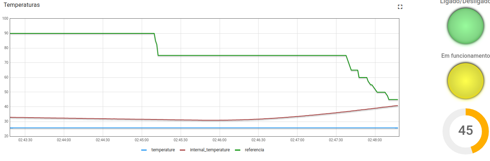

# Forno

**Conteúdo da Disciplina**: Trabalho 2 

## Aluno
| Matrícula   |         Aluno          |
| ----------- | ---------------------- |
| 18/0105345  |  Lucas Lima Ferraz     |

## Sobre 
Trabalho relativo ao que se encontra no gitlab da disciplina de fse e o vídeo encontra-se na pasta assets

## Instalação 
**Linguagem**: Python 

## Uso 
Clonar o repositório e rodar o arquivo main.py com o seguinte comando: python3 main.py

## Print
